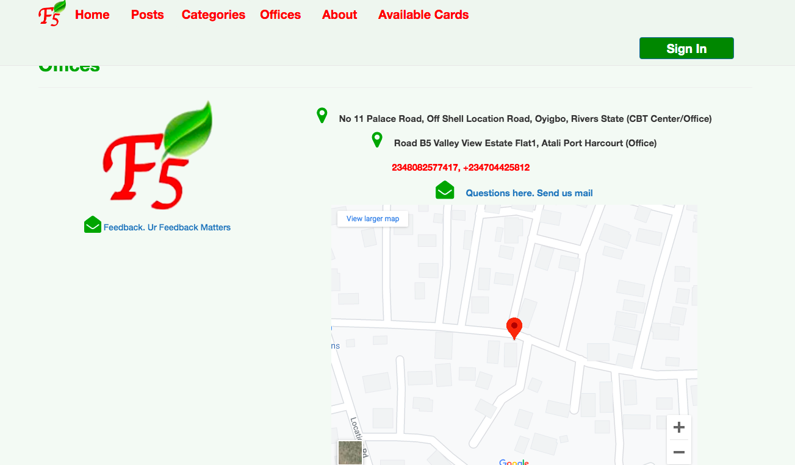

<h1 align=center> ** Business site** </h1>

[](https://github.com/RichardLitt/standard-readme)
[](https://david-dm.org/dwyl/esta)


- This project is a Business site, built for a business owner that sales Scratch card. it has a admin and a user login. 
- User can view posts, comment on posts, fund his/her wallet,
	purchase available cards.
- Admin can create a post, create category. Admin can also add 
	card types, cards, delete posts and edit, edit and delete cards etc.
- I implemented a payment system for the user to be able to fund
	his/her wallet.




## Background

- Ruby
- Rails
- Javascript
- Jquery
- SCSS
- Bootstrap 


## Demo
 Check out the live demo of the project. [Click Here](https://fastfive-app.herokuapp.com/)

## Logins 
- Admin (email: emehansome@gmail.com password: foobar)
- User (email: brightokike@gmail.co password: FOOBAR) capital letters

## Usage

```sh
$ git clone https://github.com/macbright/fastfive_site.git myproject
```
<br /> Clone the repository to your local machine


```sh
$ cd myproject
```
<br /> cd into the directory


`$ bundle install` 
<br /> to install all the gems

`$ rake db:migrate` 
<br /> to migrate the database


`$ rails server` 
<br /> to start rails server


## Maintainers 

👤  **Bright Okike**

- Github: [@macbright](https://github.com/macbright)
- LinkedIn: [@bokike](https://www.linkedin.com/in/bokike/)
- Twitter: [@b_okike](https://twitter.com/b_okike)


## Contributing

1. Fork it (https://github.com/macbright/fastfive_site.git)
2. Create your feature branch (git checkout -b feature/[choose-a-name])
3. Commit your changes (git commit -am 'What this commit will fix/add')
4. Push to the branch (git push origin feature/[chosen name])
5. Create a new Pull Request

## License

Bright okike
[MIT license](https://opensource.org/licenses/MIT).